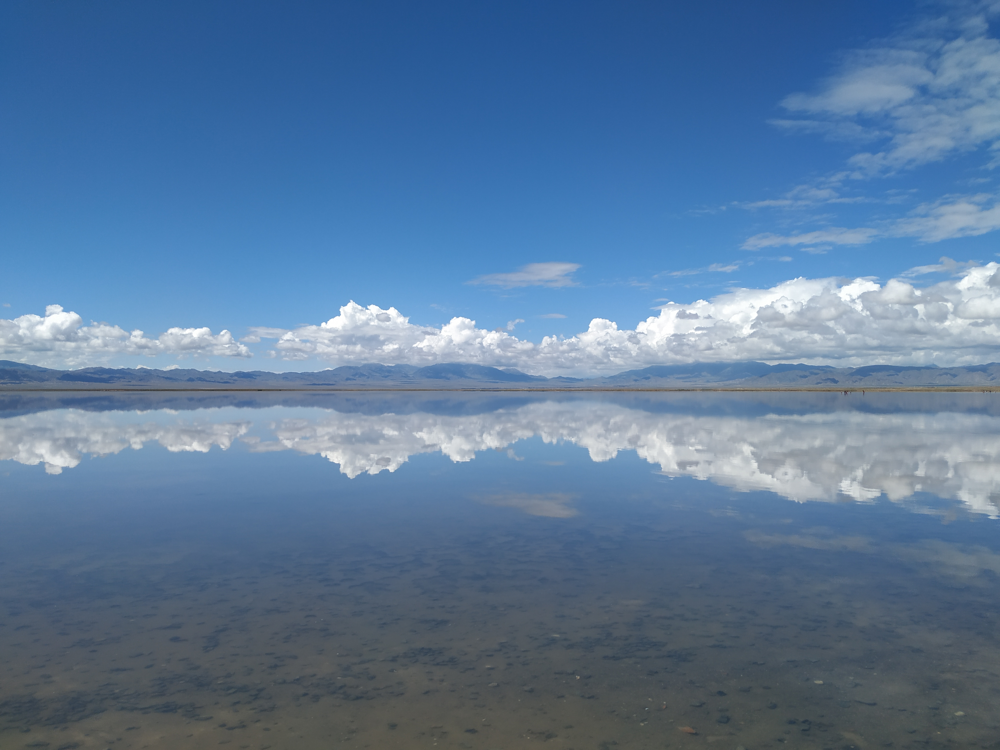
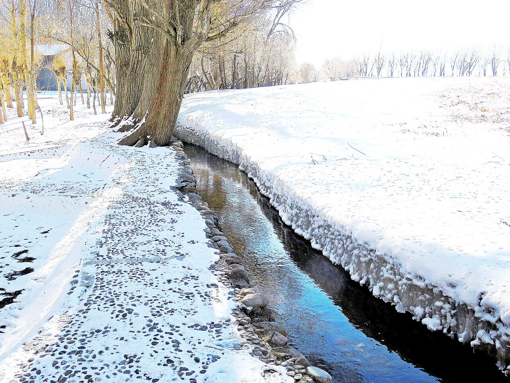
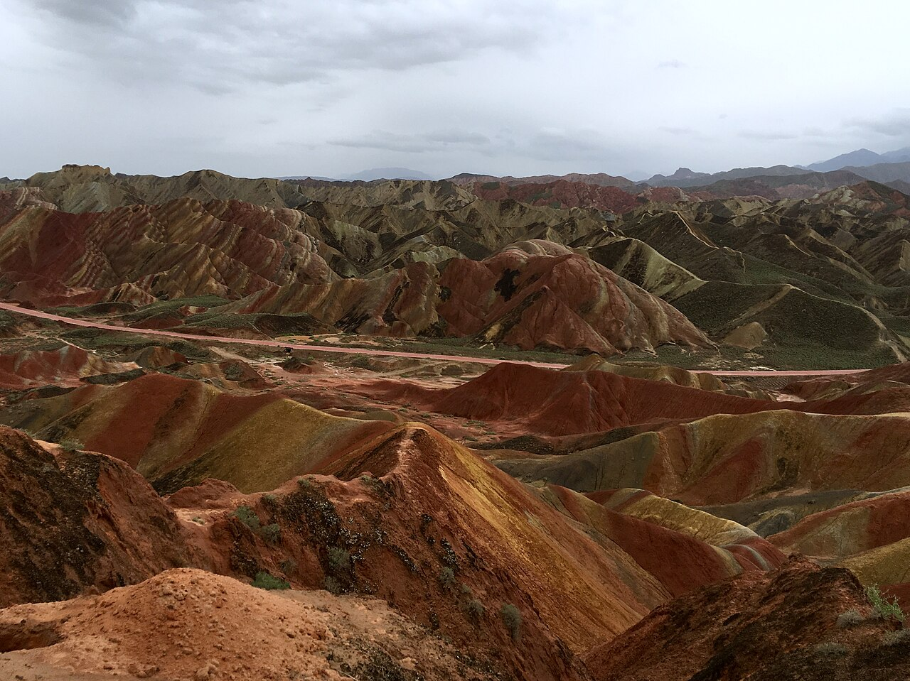

# 2026/02/19–02/25 青甘大环线（冬季自驾）

- 交通：2/19 08:45 抵达 **西宁曹家堡机场 T3** 取车（理想 L7）；2/25 **兰州中川 T3 → 厦门**：16:25–19:50（适合当晚回泉州取车）
- 还需完成：到厦门后 **回晋江机场附近取车**（泉州晋江）。
- 已知背景：你们 2/18 从晋江机场出发，车留在晋江机场附近，返程需去取回。
- 团队：3–4 人，中档住宿偏好。
- 主题：盐湖 + 雅丹地貌 + 敦煌人文 + 雪山草原 + 星空。

> 冬季（2 月）青甘环线的核心难点是：**暗冰/封路/景区冬季营业调整**。
> 本计划以“可落地执行”为第一目标：把**最长距离放在中段**，最后一天以“稳到机场”为优先。

---

## 行程示意（冬季版）

---

## 一、路线总览

### 西宁进、兰州出（更适合当晚回泉州取车）

曹家堡 T3（取车） → 青海湖/共和 → 茶卡/德令哈 → 大柴旦（翡翠湖） → 敦煌（2 晚） → 嘉峪关 → 张掖 → 兰州中川 T3（还车/飞）

- 建议驾驶节奏：**不夜驾、不抢早黑冰**；遇到大风/降雪预警，立刻切换备选方案。
- 用车建议（理想 L7）：
  - 2 月强烈建议携带/租用 **防滑链**（即使四驱也建议备），检查轮胎状态；
  - 玻璃水建议 -25℃，备应急电源、拖车绳、反光背心、三角牌。

---

## 二、每日行程（8 天 7 晚）

### 插图：每日强度一览（建议）

> 下面用“车程等级”快速判断哪天更累：
> - 🟩 轻松（≤4h）  - 🟨 中等（4–6h）  - 🟥 辛苦（≥7h/易受封路影响）

| 天数 | 日期 | 住哪里 | 车程等级 | 备注 |
|---|---|---|---|---|
| D1 | 02/19 | 共和/青海湖 | 🟩 | 抵达日，适应海拔 |
| D2 | 02/20 | 德令哈 | 🟨 | 茶卡开放则停留 |
| D3 | 02/21 | 大柴旦 | 🟩 | 下午翡翠湖（看开放） |
| D4 | 02/22 | 敦煌 | 🟥 | 长距离赶路日 |
| D5 | 02/23 | 敦煌 | 🟩 | 莫高窟需预约 |
| D6 | 02/24 | 张掖 | 🟥 | 敦煌→张掖较长 |
| D7 | 02/25 | 返程 | 🟥 | 以“稳到机场”优先 |

### D1｜02/19（周四）西宁机场 → 青海湖/共和（住共和更稳）

_图：D1 青海湖_

- 08:45 抵达曹家堡 T3
- 09:30–10:30：取车、加油、采购补给（热水/路餐/氧气/纸巾）
- 路线：曹家堡机场 → 日月山方向 → 青海湖湖东（视路况）→ **共和县城**
- 车程：约 150–220 km，3–4 小时
- 玩法建议：冬季青海湖以 **冰封湖面 + 日落** 为主，风大体感低温。

住宿建议：共和县城（更稳定）
- 筛选关键词：`供暖/暖气`、`24h热水`、`停车方便`、`评分高`。

### D2｜02/20（周五）共和/青海湖 → 茶卡 → 德令哈（住德令哈）

_图：D2 茶卡盐湖_

- 路线：共和/青海湖 → 茶卡镇（盐湖）→ 德令哈市区
- 车程：约 300–400 km，4–6 小时（含停留）
- 重点：**茶卡盐湖冬季开放情况**（见“出发前核验清单”）
- 住宿：德令哈市区（城市配套好，供暖更稳）

住宿建议：德令哈市区
- 筛选关键词：`市区`、`供暖强`、`停车场`、`早餐`。

### D3｜02/21（周六）德令哈 → 大柴旦（翡翠湖）住大柴旦

_图：D3 翡翠湖_

- 路线：德令哈 → 大柴旦镇
- 车程：约 200–300 km，3–4 小时
- 下午：大柴旦翡翠湖（视开放/冰面安全限制）

住宿建议：大柴旦镇
- 冬季更看重“暖气/热水/房间干净”，不要为了便宜选供暖不稳的民宿。

### D4｜02/22（周日）大柴旦 → 敦煌（长距离赶路日，住敦煌）

- 路线：大柴旦 →（G315/G3011 一带）→ 敦煌
- 车程：约 550–650 km，8–10 小时（冬季建议天亮就走）
- 可选停靠（视天气/管制）：
  - G315 观景点（**严禁占道停车拍照**，冬季暗冰非常危险）
  - 路边雅丹/戈壁观景点（不建议深入无人区道路）

住宿建议：敦煌沙州市区（建议住 2 晚不换酒店）
- 筛选关键词：`沙州市区`、`停车`、`暖气`、`离夜市不远`。

### D5｜02/23（周一）敦煌：莫高窟 + 鸣沙山月牙泉

上午：莫高窟（强烈建议预约最早时段）

_图：D5 莫高窟_

- 已核到可用入口：[https://www.mgk.org.cn/](https://www.mgk.org.cn/)（莫高窟预约网首页）
- 参观咨询电话（页面展示）：`4008-333-715`

下午：鸣沙山月牙泉

_图：D5 鸣沙山月牙泉_

- 冬季日落很出片，但风可能很大；注意景区冬季开闭园时间。

晚上：如天气好可拍星空
- 体感温度低，务必防风羽绒+暖宝宝+手套。

### D6｜02/24（周二）敦煌 → 嘉峪关 → 张掖（住张掖）

- 路线：敦煌 → 嘉峪关 → 张掖市区（甘州区）
- 车程：约 600 km，7–9 小时（含停留）
- 可选：嘉峪关关城/长城第一墩（视冬季开放）

_图：D6 嘉峪关_

- 可选：张掖七彩丹霞（以冬季开放/路况为准；更适合下午早一点进景区，确保天黑前回张掖市区；不建议为丹霞增加夜路）

_图：D6 张掖七彩丹霞_

住宿建议：张掖市区（甘州区）
- 目的：为 D7 早出发上高速做准备。

### D7｜02/25（周三）返程日：张掖 → 兰州中川 T3（16:25 起飞，到厦门 19:50）

> 这一天目标：**稳稳到机场**，并尽量不影响当晚回泉州取车。

- 推荐路线（更稳）：张掖 → 连霍高速方向 → 兰州新区/中川机场
- 预计车程：约 500–600 km，6–7 小时（视管制/天气波动）
- 时间表（建议）：
  - 07:30–08:00：从张掖出发（尽量加满油、带路餐）
  - 14:00 前：到达中川机场附近/还车点（预留高速管制缓冲）
  - 14:00–15:00：还车、整理行李、进航站楼
  - 15:00 前后：完成值机/托运更稳；**最晚 15:30 进入安检队列**
  - 16:25：起飞；19:50 抵达厦门 → 当晚回泉州取车压力相对小
---

## 三、住宿与订房建议（2 间房：情侣 1 间 + 两位男生 1 间）

人员结构：一对情侣 + 两位男生，共 4 人，建议全程 **2 间房**。

### 订房策略（更省心、退改更稳）

- 建议每晚订：
  - 1 间：`大床房`（情侣）
  - 1 间：`双床房`（两位男生）
- 备选方案（某些小城双床紧张时）：
  - 2 间 `大床房`（接受度更高、最容易订到）
  - 或 1 间 `家庭房/三人间` + 1 间 `大床房`（看酒店是否有且供暖稳定）
- 实操建议：
  - **优先选择可免费取消/延迟取消**的订单（冬季封路、计划易变）
  - 到德令哈/敦煌/张掖这类城市尽量选连锁或口碑酒店（供暖/热水/停车更稳）
  - 小城/小镇（如大柴旦）务必在订单备注里写：`需要暖气/地暖正常，24h 热水`，到店前当天再电话确认

### 冬季酒店选择原则

> 冬季酒店选房优先级：供暖（暖气/地暖）＞ 热水压力与水温 ＞ 停车 ＞ 位置。

- 共和：县城连锁/品质酒店；避免湖边不稳定民宿
- 德令哈：市区连锁（更稳定，双床也更好订）
- 大柴旦：镇上尽量选“新/评分高/供暖明确”的酒店；双床不一定多，尽早订
- 敦煌：沙州市区连锁/品质酒店，建议连住 2 晚（减少折腾）
- 张掖：甘州区市区连锁，方便次日早上高速

可直接用的筛选关键词（订房 App）：
- `有暖气`、`地暖`、`可停车`、`24小时热水`、`近主干道`、`评分 4.6+`、`双床`、`可免费取消`。

---

## 四、景点与门票/预约（冬季重点）

- 莫高窟：需要实名预约，旺季更紧张；冬季也建议提前锁定。
  - 预约入口：`https://www.mgk.org.cn/`
- 鸣沙山月牙泉：关注冬季开闭园时间与大风预警闭园。
- 茶卡盐湖：冬季开放/经营区域每年变化，务必核验。
- 翡翠湖：冬季可能因冰面安全限制开放范围。
- 雅丹/戈壁公路拍照：冬季更危险，遵守交通法规，不占道。

---

## 五、出发前 48–72 小时“最新信息核验清单”（强制）

请在出发前 2–3 天逐条核对，并把截图/链接发我可协助改行程：

1) 茶卡盐湖
- 是否开放、开放时间
- 是否需要景交/摆渡车
- 是否开放到“可拍盐湖”的核心区域

2) 大柴旦翡翠湖
- 是否开放、开放时间
- 是否有冰面安全限制/封闭区域

3) 敦煌莫高窟
- `mgk.org.cn` 的开放日历、预约票种说明、入园时间规则

4) 鸣沙山月牙泉
- 冬季开闭园时间
- 大风/沙尘预警是否闭园

5) 路况/封路（冬季决定性）
- G315/G3011 及沿线是否临时交通管制
- 2/25 张掖 → 兰州中川：高速是否有降雪/结冰管制

建议信息来源：交管/高速路况平台、目的地融媒体公众号、景区官方公告（以“最新公告”为准）。

---

## 六、冬季自驾安全与装备清单（必备）

- 防滑链（建议必带）、胎压/备胎状态确认
- 保暖：冲锋衣/厚羽绒、雪地靴、护脸、防风手套
- 应急：应急电源、拖车绳、反光背心、三角牌、头灯
- 药品：高反药按个人情况、感冒药、肠胃药、创可贴
- 车内：保温水、路餐、纸巾、垃圾袋

驾驶原则：
- 不夜驾、不疲劳驾驶；清晨/傍晚更容易暗冰。
- 拍照不停车占道；风雪天不进无人区、不走非铺装小路。

---

## 七、航班选择建议（结合“还要回晋江机场附近取车”）

### 厦门落地后去晋江机场取车（操作性对比）

> 简化原则：尽量避免深夜跨城折返。

- 路线距离：厦门（高崎机场/市区）→ 晋江机场（泉州晋江）通常车程约 1–1.5 小时（视路况/出入岛/高速情况）。
- 建议优先选择的交通方式（按稳妥排序）：
  1) **网约车/出租车直达**：最省心，适合多人分摊；深夜也可用但价格更高。
  2) **机场大巴/城际大巴 + 短途打车**：班次受时间影响，晚点时不稳定。
  3) **高铁（厦门北/厦门站 → 晋江站）+ 打车到机场**：路段快，但需要转乘、且深夜班次不一定合适。

- 航班"当晚取车"的时间安排：
  - **兰州 → 厦门 16:25–19:50**：
    - 正常落地后，取行李+出机场通常 20:30 左右可出发；
    - 21:30–22:00 左右抵达晋江机场附近取车更常见（整体可操作）。

- 建议你们确认的“关键规则”（决定能否当晚取车）：
  - 晋江机场附近取车点是否 **24 小时可取**（或最晚营业时间）
  - 是否需要提前预约/刷身份证/押金等手续

### 航班选择

- **兰州 → 厦门（16:25–19:50）**
  - 到厦门更早，回泉州取车更从容；
  - 2/25 当天只要按高速直达机场，整体风险可控。
  - 仍建议提前 48–72 小时根据天气/路况做最后一版确认。
